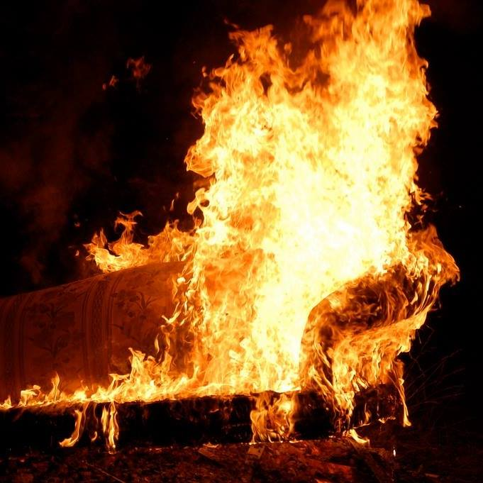
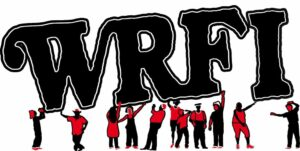

+++
title = "Community Engagement:"
subtitle = "AskPearl for Ithaca & Tompkins County"
banner = "img/banner.png"
+++

Designed for curious people who wanted more than a cursory overview of what was happening in Tompkins County. Local resource featuring art events, activities, and opportunities that promote social interactions and engagement.

Socializing and spending time together face-to-face is essential for a vibrant community. AskPearl was an open invitation to participate and experience something new and different.

We worked with local businesses, non-profits, radio stations and news outlets to counteract the increasing fragmentation of information and create access and inclusion across different social, cultural and economic groups.

**Our aim was to highlight what’s often overlooked or undervalued, bridging the neighborhoods, villages, towns, and colleges that comprise greater Tompkins County.**

Growth and change start when people connect and share experiences.

We believe that in a healthy community, everyone feels invited to participate and engage.

---

**Off the Couch**

WEAVE Community worked hand-in-hand with local radio station WRFI, community radio for Ithaca and Watkins Glen to develop and host weekly, an hour long show dedicated to the arts.  Off the Couch featured several interviews, live streams and opportunities for community members to engage with artists at various venues throughout the listening area. We also recorded 2 minute spots for broadcast daily to highlight specific arts related events.

