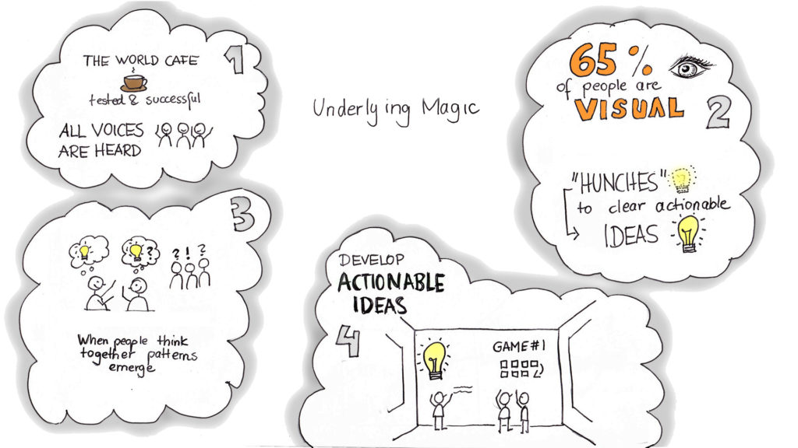
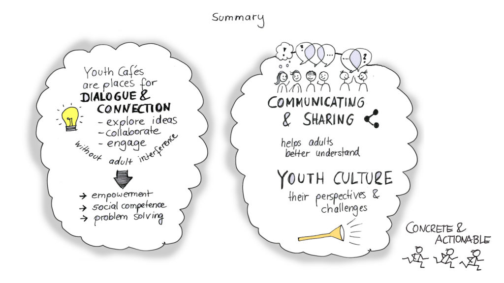

+++
title = "Youth Engagement: Shut Up and Listen"
Banner = "img/banner.jpg"
+++

**“Shut Up and Listen”** was a pilot project specifically structured for rural middle and high schoolers to express their perspectives and experiences to the larger community without adult interference.

---

In Tompkins County, sustained youth engagement is less than 33%... It could be more!

Youth are invited to challenge the status quo creatively, respectfully, and use their skills to communicate and create actionable ideas for change. Device-free face-to-face interaction and shared experience are at the heart of  the collaborative effort.

Building on the successful social technology of the World Cafe, we include strategies from visual thinking experts, “game storming”, and non-zero sum principles while providing a fun, safe and engaging environment. The participants are a diverse group of youth, a cross-section of a school or community who are invited by peers and trusted adults.

These interactions and dialogue lead to youth empowerment, pride and engagement. Skills they develop include visual thinking, game strategies, collaboration, creativity, and developing actionable ideas, which are then shared with the larger community.

Last but not least, participants rediscover how to read social cues, and practice the challenges and rewards of a device free conversation... important skills for navigating any conversation and particularly those that are difficult.

  
*\*Source: Communities that Care* Youth Survey October 2016

*% of students (grades 7-12) who self-report they have participated 10+ times in the past year in clubs, organizations or activities in school or the community*